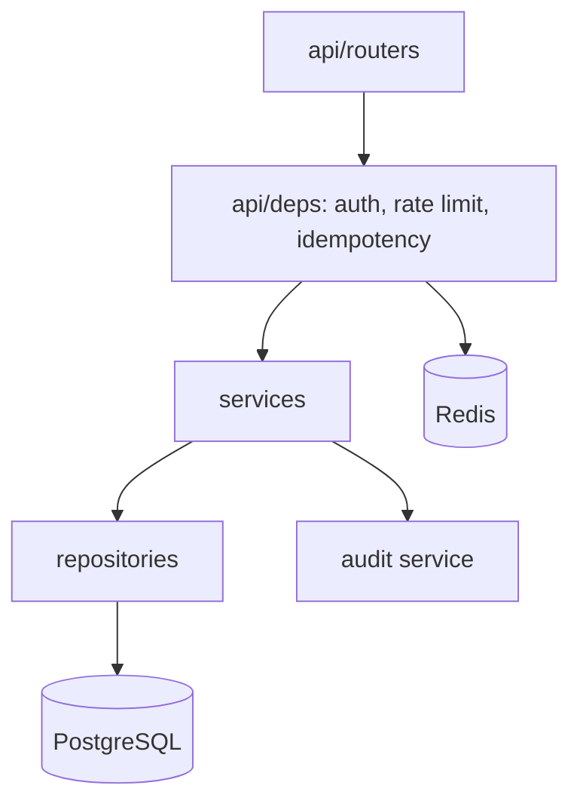

# taskflow-api

A projects-and-tasks REST API used as a vehicle to get the boring parts right: an audit
trail that survives user deletion, idempotency that holds under concurrent retries, and
rate limiting that is actually atomic. The CRUD is the pretext.

> **Status: under construction.** Phase 0 (foundation) is done. The sections below describe
> what exists today; anything not implemented yet is marked as such rather than promised.

## Problem

Most task-management APIs in the wild are correct only when requests arrive one at a time.
Retry a `POST` after a timeout and you get a duplicate. Read a paginated list while someone
is inserting and you silently skip rows. Delete a user and the audit trail loses its author.
Knock the rate limiter's Redis over and the whole API goes down with it.

None of that shows up in a demo, and all of it shows up in production. This project treats
those four as the actual feature set, and the domain — projects, tasks, memberships — as the
smallest interesting thing to hang them on.

## Features

Implemented:

- Liveness probe (`/health`) that deliberately touches no dependency.
- Configuration fully externalised and validated at startup, secrets held in `SecretStr`.
- Layered skeleton (`api` → `services` → `repositories` → `db`) with strict typing.

Planned, in implementation order:

- Users, JWT auth, global and per-project roles.
- Projects, memberships, tasks, with authorisation by membership.
- Append-only audit trail that outlives the actor.
- Cursor pagination, `Idempotency-Key` on `POST`, Redis rate limiting.
- Structured JSON logs with a correlation ID per request.

## Architecture



The rule that keeps the layers honest: **the domain core receives and returns dataclasses or
Pydantic objects, never a `Session` and never a `Request`.** If a service function needs a
database session to be testable, the boundary is in the wrong place.

Naming convention, to avoid the usual FastAPI confusion: `db/models.py` holds **ORM** models,
`api/schemas.py` holds **Pydantic** schemas. The bare word "model" is not used.

## Requirements

- Python 3.12 (pinned — this is a service, not a library)
- [`uv`](https://docs.astral.sh/uv/)
- Docker and Docker Compose, for Postgres, Redis and the integration tests

## Installation

```bash
uv sync
cp .env.example .env
```

## Configuration

Every setting is an environment variable; `.env.example` is the authoritative list.

| Variable | Default | Meaning |
|---|---|---|
| `ENVIRONMENT` | `local` | `local`, `ci` or `production`. Disables `/docs` when `production`. |
| `LOG_LEVEL` | `INFO` | `DEBUG`, `INFO`, `WARNING` or `ERROR`. |
| `DATABASE_URL` | — | Async DSN. The driver must be `asyncpg`. |
| `REDIS_URL` | — | Used by the rate limiter. |
| `JWT_SECRET` | — | HMAC signing key. Never logged. |
| `JWT_ALGORITHM` | `HS256` | Signing algorithm. |
| `ACCESS_TOKEN_TTL_MINUTES` | `15` | 1–60. With no refresh token, this window is the security boundary. |

## Usage

```bash
docker compose up -d          # Postgres + Redis
uv run uvicorn taskflow_api.main:create_app --factory --reload
curl localhost:8000/health
```

Interactive docs at `http://localhost:8000/docs` outside production.

## Testing

```bash
uv run pytest                      # everything
uv run pytest -m "not integration" # unit only — offline and deterministic
```

Integration tests start real Postgres and Redis containers through `testcontainers`, so they
need Docker running and the images available locally. This is the documented exception to the
"tests run offline" rule: unit tests honour it, integration tests cannot and should not.

## Docker

`docker-compose.yml` brings up Postgres 16 and Redis 7 with health checks. The `Dockerfile` is
multi-stage and the final image runs as a non-root user.

## Observability

Structured JSON logging and per-request correlation IDs arrive in Phase 5.

## Design decisions

Architecture decision records live in [`docs/adr/`](docs/adr/).

## Limitations

Honest, and deliberate:

- Not genuinely multi-tenant — isolation is by membership, not by schema or database.
- No refresh token and no token revocation. Access tokens are short-lived, and the ADR
  describes how a `jti` denylist would work if it were needed.
- No notifications, email, or realtime.
- Rate limiting is a sliding window, not an API gateway.

## Roadmap

Phases 1 through 5: persistence, auth, projects and tasks, cross-cutting concerns,
observability and delivery.

## Contributing

Keep the domain core free of I/O, keep unit tests offline, and run `ruff`, `mypy` and
`pytest` before opening a PR.

## License

MIT — see [LICENSE](LICENSE).

## Contact

David Oliveira — davidoliveira.devbr@gmail.com
