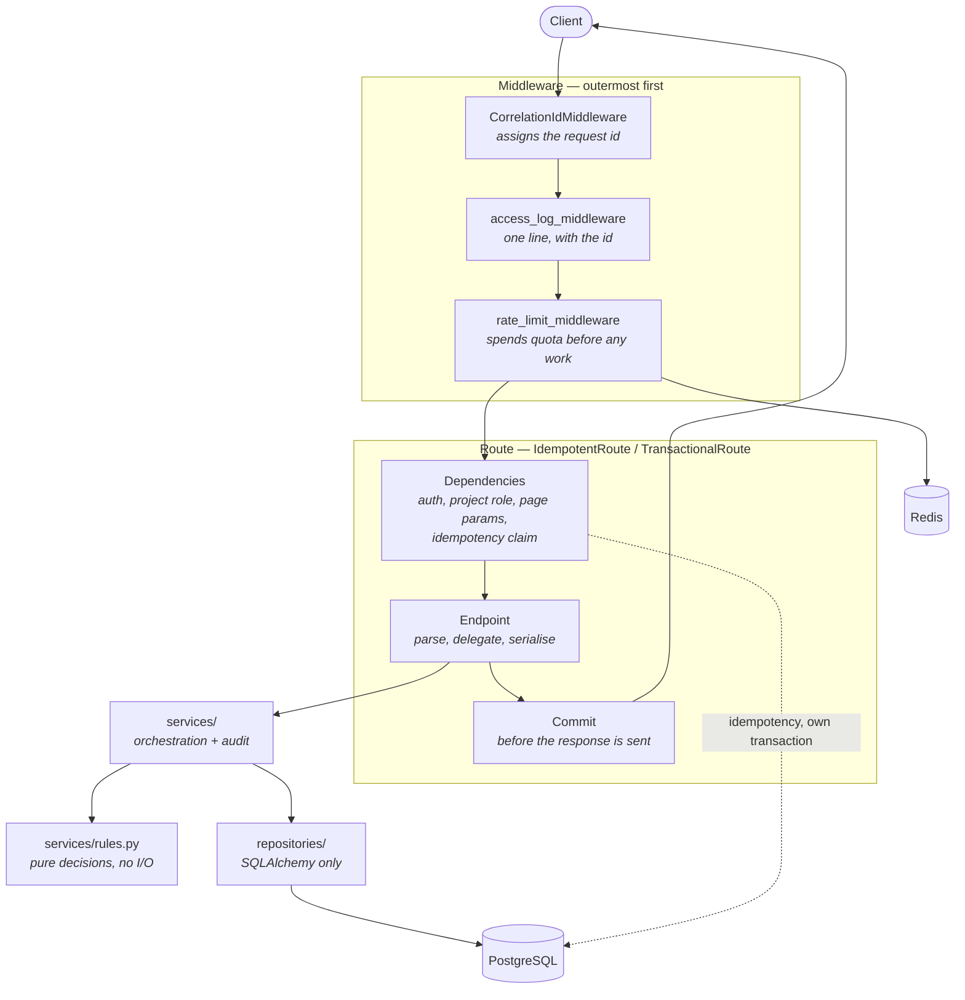
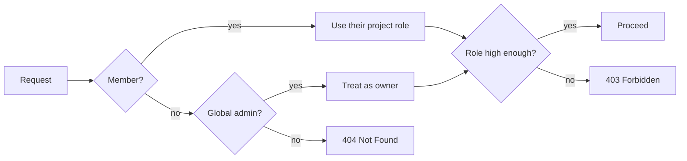

# Architecture

## The shape of a request



Two orderings in that diagram are load-bearing, and both were bugs first:

- **The rate limiter runs before routing.** Quota has to be spent before any handler or
  database work happens, or it protects nothing.
- **The commit happens inside the route, not in a dependency's teardown.** FastAPI unwinds
  the dependency exit stack *after* the response has gone to the client, so a session that
  committed there acknowledged writes before they were durable
  ([ADR 0006](adr/0006-commit-before-the-response-is-sent.md)).

## Layers

| Layer | Knows about | Never touches |
|---|---|---|
| `api/` | HTTP, status codes, Pydantic schemas | SQLAlchemy queries |
| `services/` | Domain rules, orchestration, the audit trail | `Request`, status codes |
| `services/rules.py` | Nothing but its arguments | I/O of any kind |
| `repositories/` | SQLAlchemy, the session | Business rules, transactions |
| `db/` | Engine, session factory, ORM models | Everything above |

The split that carries the most weight is the last one inside `services/`. Rules are pure
functions taking plain values, so "the only owner cannot be demoted" is unit-tested offline
in milliseconds; the orchestration around them needs a database and is tested against a real
one. It is the same separation the earlier projects in this portfolio used between reading
the world and judging it.

`db/models.py` holds **ORM** models and `api/schemas.py` holds **Pydantic** schemas. The bare
word "model" is not used anywhere in the project — that ambiguity is the most common source
of confusion in FastAPI codebases, and the cheapest to design out.

## Data model

```mermaid
erDiagram
    USERS ||--o{ MEMBERSHIPS : holds
    PROJECTS ||--o{ MEMBERSHIPS : grants
    PROJECTS ||--o{ TASKS : contains
    USERS ||--o{ TASKS : "assigned (SET NULL)"
    USERS ||--o{ AUDIT_LOG : "acted (SET NULL)"
    USERS ||--o{ IDEMPOTENCY_KEYS : scopes

    USERS {
        uuid id PK
        string email UK
        string hashed_password
        string global_role "CHECK admin|user"
        bool is_active "soft delete"
    }
    PROJECTS {
        uuid id PK
        string name
        uuid owner_id FK "creator, never an auth decision"
        bool is_archived "soft delete"
    }
    MEMBERSHIPS {
        uuid user_id PK_FK
        uuid project_id PK_FK
        string project_role "CHECK owner|editor|viewer"
    }
    TASKS {
        uuid id PK
        uuid project_id FK
        string status "CHECK todo|doing|done"
        int priority "CHECK 1..5"
        uuid assignee_id FK "nullable"
    }
    AUDIT_LOG {
        uuid id PK
        uuid actor_id FK "nullable"
        string actor_email "denormalised on purpose"
        string action
        jsonb metadata "mapped as details"
    }
    IDEMPOTENCY_KEYS {
        uuid user_id PK_FK
        string key PK
        string request_hash
        string status "CHECK in_progress|completed"
        jsonb response_snapshot
        timestamp expires_at
    }
```

Decisions worth naming:

- **UUID primary keys.** Sequential ids let anyone walk the API by incrementing a number and
  turn a 403 into a census of what exists.
- **`actor_email` is denormalised.** `actor_id` is `ON DELETE SET NULL`, so without the copy
  the trail would forget its author exactly when that matters most.
- **The composite key on `idempotency_keys` is the mechanism, not a constraint.** Serialising
  concurrent replays depends on the second request *losing an insert*
  ([ADR 0007](adr/0007-idempotency-serialised-by-the-database.md)).
- **Enums are VARCHAR + CHECK, storing the member value.** SQLAlchemy stores the member
  *name* by default and `native_enum=False` creates no constraint at all — so the database
  held `OWNER` while the API said `owner`, and the columns accepted any string. Both
  defaults are overridden in `_enum_column`.

## Authorisation

Membership decides everything. `Project.owner_id` records who created a project and is never
consulted for a permission check — two sources of truth for one question is how "the owner
cannot open their own project" bugs happen.



A stranger gets **404, not 403**: a 403 confirms the resource exists, which turns id probing
into a directory of other people's projects. The 403 only appears once membership is
established, when the caller already knows the thing is there.

## Testing

| Kind | Runs | Proves |
|---|---|---|
| Unit | Offline, no Docker (`make test-unit`) | Pure rules, schemas, error mapping, limiter arithmetic |
| Integration | Postgres + Redis via testcontainers | Wiring, authorisation, the database's own guarantees |
| Read-after-write | A **live uvicorn on a socket** | Ordering the in-process transport cannot see |

The third row exists because of a bug. `httpx`'s ASGI transport awaits the whole application
call, teardown included, so the suite was structurally blind to work happening after the
response was sent. Anything whose correctness depends on *when* something happens relative
to the response needs a real socket to be tested honestly.

The schema under test is built by running the **actual Alembic migration**, not
`create_all`, so every integration run also proves `upgrade head`
([ADR 0003](adr/0003-testcontainers-and-real-migrations.md)).

## Decision records

| ADR | Subject |
|---|---|
| [0001](adr/0001-framework-and-stack.md) | FastAPI, SQLAlchemy 2.0 async, PyJWT over python-jose |
| [0002](adr/0002-liveness-separate-from-readiness.md) | `/health` never touches a dependency; `/ready` does |
| [0003](adr/0003-testcontainers-and-real-migrations.md) | testcontainers, and the schema from the real migration |
| [0004](adr/0004-jwt-without-refresh-or-revocation.md) | Short access tokens, no refresh, `jti` reserved for a denylist |
| [0005](adr/0005-project-authorisation-and-soft-delete.md) | Membership-based authorisation, soft delete, audit in-transaction |
| [0006](adr/0006-commit-before-the-response-is-sent.md) | The request transaction commits before the response is sent |
| [0007](adr/0007-idempotency-serialised-by-the-database.md) | Idempotency serialised by the database, in its own transaction |
| [0008](adr/0008-rate-limiting-atomic-and-fail-open.md) | Sliding window in Lua, failing open |
